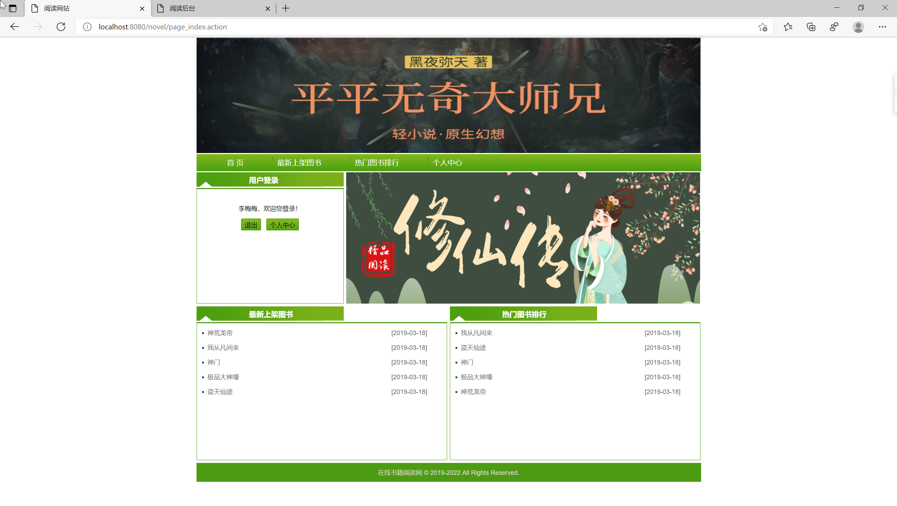

## 基于SSM框架的在线小说阅读系统

###  获取sql数据库文件: 从戎源码网 (https://armycodes.com/) QQ: 386869957 QQ群: 377586148
###  所有系统地址: (https://github.com/YuLin-Coder/AllProjectCatalog) 
###  所有项目以及源代码本人均调试运行无问题 可支持远程安装部署调试、定制修改、代码讲解

## 项目介绍
基于SSM框架的在线小说阅读系统，系统分为用户和管理员两个角色，主要功能如下
用户登录后可以查看各种小说章节。后台管理员进行小说维护
前台包含以下模块: 首页、最新上架图书、热门图书排行、个人中心
后台包含以下模块：个人信息模块、通用户管理、会员用户管理、支付记录管理、
会员余额查询、图书类别管理、图书信息管理、书评信息管理

## 项目技术
- 编程语言：Java
- 数据库：MySQL
- 前端技术：JSP、JavaScript、jquery
- 后端技术：Spring、SpringMVC、MyBatis

## 运行环境
- JDK版本：JDK1.8及以上
- 开发工具：IDEA、Ecplise、Myecplise都可以
- 数据库: MySQL5.7及以上

## 运行截图

